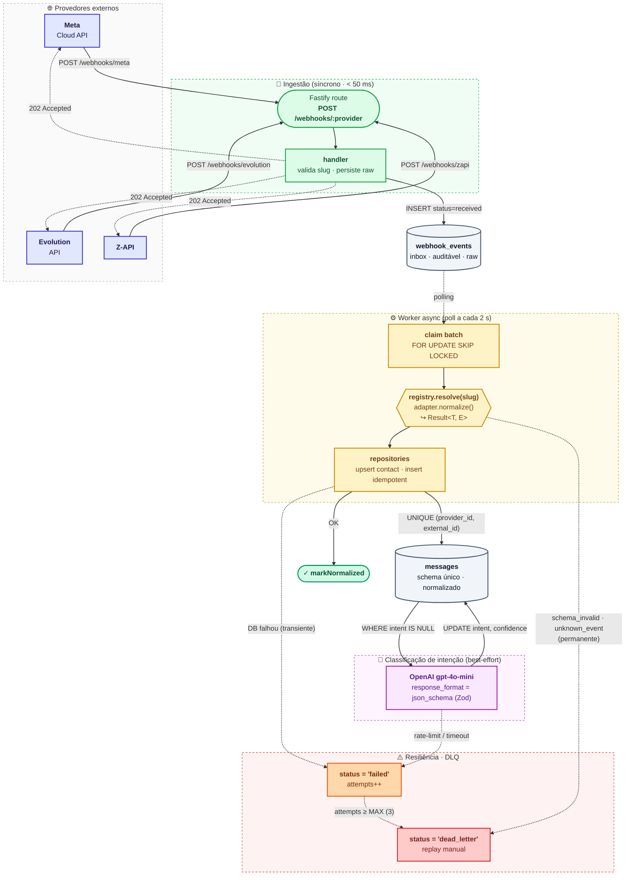

# Arquitetura — SuperSDR Webhook Normalizer

> Documento técnico complementar ao README. Foca em **como** e **por quê** das decisões.

## Diagrama de fluxo



> 💡 **Como ler o diagrama:**
> - **Caixas verdes** = camada HTTP síncrona (responde em <50ms).
> - **Caixas amarelas** = worker async (drena `webhook_events` em background).
> - **Caixa roxa** = chamada à OpenAI (best-effort — falhar aqui não bloqueia o pipeline).
> - **Cilindros cinzas** = tabelas Postgres.
> - **Caixas vermelhas/laranjas** = caminhos de erro (retry com backoff e DLQ).
> - **Setas pontilhadas** = comunicação assíncrona (poll, ack, retry).

## Patterns aplicados

### 1. Adapter
Cada provedor é um `ProviderAdapter` (`src/providers/types.ts`) com duas operações:

- `canHandle(payload)` — sniff barato pra defesa em profundidade
- `normalize(payload) → Result<NormalizedMessage, AdapterError>` — validação e mapeamento

Os arquivos `meta.ts`, `evolution.ts`, `zapi.ts` são independentes: cada um conhece SEU formato e produz o mesmo `NormalizedMessage`.

### 2. Registry com self-registration
`registry.register(new XAdapter())` é chamado **no fim do arquivo do adapter** (side-effect import). O `index.ts` importa os 3, registrando-os automaticamente.

**Cumpre Open/Closed:** novos providers entram sem tocar código existente. Demonstrado no README ("Adicionando um provider em 3 passos").

### 3. Result<T, E>
Substitui exceções para erros previsíveis (`schema_invalid`, `unknown_event`, etc). Caller decide via discriminated union — TypeScript força exaustividade.

```ts
const r = adapter.normalize(payload);
if (!r.ok) {
  // r.error é tipado como AdapterError aqui
  return reply.code(422).send(...);
}
// r.value é NormalizedMessage aqui
```

### 4. "Acknowledge first, process async"
Padrão Stripe / Shopify / Slack. O endpoint:

1. Persiste o payload cru em `webhook_events` (1 INSERT)
2. Retorna **202 Accepted** em <50ms
3. Um worker async drena a tabela em background

**Por quê?** Webhook senders fazem retries agressivos em não-2xx. Fazer trabalho lento (LLM ~5s) in-line gera timeouts e duplica eventos. Persistir cru também dá audit trail e replay.

### 5. Idempotência via UNIQUE
Em `messages(provider_id, external_id)`. Webhook duplicado: o segundo INSERT ativa `ON CONFLICT DO NOTHING` e o repositório retorna a row existente.

Os providers retentam ativamente (Meta retenta por até 7 dias) — sem isso, mensagens duplicariam silenciosamente.

### 6. SELECT ... FOR UPDATE SKIP LOCKED
No `claimPendingBatch`: o worker reivindica eventos em uma transação. Se rodássemos N workers (ainda não, mas a porta está aberta), nenhum pegaria o mesmo evento.

### 7. DLQ in-table
Não usamos Redis/BullMQ. `webhook_events.status='dead_letter'` cumpre a função de DLQ:

- Erros **permanentes** (schema inválido, evento desconhecido) viram dead-letter na 1ª tentativa
- Erros **transientes** (DB blip, LLM down) retentam até `WORKER_MAX_ATTEMPTS` antes de virar dead-letter
- Replay = `UPDATE webhook_events SET status='received', attempts=0 WHERE id=...`

### 8. Configuração à prova de bala
`src/config.ts` valida `process.env` com Zod no boot. Falta de `OPENAI_API_KEY`? **Crash imediato**, não duas horas depois quando a primeira mensagem cair.

## Modelo de dados

```
providers              contacts                    messages
─────────              ────────                    ────────
id PK                  id PK                       id PK
name                   provider_id FK ─┐           provider_id FK ───┐
is_active              external_id     │           external_id        │
created_at             display_name    │           contact_id FK ─────┤
                       phone_number    │           direction          │
                       metadata jsonb  │           message_type       │
                       UNIQUE(prov,id) ┘           content            │
                                                   raw_payload jsonb  │
                                                   occurred_at        │
                                                   received_at        │
                                                   intent             │
                                                   intent_confidence  │
                                                   intent_classified_at
                                                   UNIQUE(prov, ext)  │
                                                                      │
                                                            webhook_events
                                                            ──────────────
                                                            id PK
                                                            provider_id (nullable)
                                                            status
                                                            raw_payload jsonb
                                                            headers jsonb
                                                            error
                                                            attempts
                                                            message_id FK ─┘
                                                            received_at
                                                            processed_at
```

**Decisões:**

- **`contacts` é por provider**, não global. A mesma pessoa no Meta vs no Z-API usa identificadores diferentes (`wa_id` E.164 sem `+` vs `phone` com mesmo formato — mas a chave conceitual é "qual canal"). Unificação de identidade é problema separado.
- **`messages.raw_payload`** preservado: regulatório (LGPD), debug, futura migração de schema sem perder dados.
- **`webhook_events`** é nosso **inbox**: tudo entra, mesmo malformado. Sem isso não há replay confiável.

## Resiliência — matriz de falhas

| Causa raiz | Detecção | Ação |
|---|---|---|
| Payload com schema diferente | `adapter.normalize()` retorna `schema_invalid` | dead_letter na 1ª tentativa, audit em `webhook_events.error` |
| Tipo de mensagem não suportado (ex: button reply) | `unsupported_message_type` | dead_letter na 1ª tentativa |
| Provider envia evento de status (não mensagem) | `unknown_event` | dead_letter — cria ruído mínimo em logs |
| DB indisponível durante normalização | Drizzle throw → catch no processor | retry com backoff exponencial até 3x |
| OpenAI indisponível ou rate limit | LLM throw | mensagem persiste; `intent_classified_at` null. Falha NÃO bloqueia o pipeline |
| Webhook duplicado pelo provider | UNIQUE em messages | `ON CONFLICT DO NOTHING`, retorna row existente |
| Race condition entre 2 workers (futuro) | `FOR UPDATE SKIP LOCKED` | um pega, o outro pula |
| Hostinger reboot | `restart: unless-stopped` no compose | container volta sozinho; `webhook_events` retém o backlog |

## O que não foi feito (e por quê)

- **BullMQ + Redis** — over-engineering pro escopo. A fila in-table cobre os requisitos da prova; documentado o caminho de migração.
- **Signature verification (HMAC)** — cada provider tem o seu (Meta usa `X-Hub-Signature-256`, Z-API usa secret no payload, Evolution usa apikey no body). Em produção real é obrigatório, mas adicionar 3 implementações distintas não muda a arquitetura — é por adapter.
- **Identidade unificada de contato** — uma pessoa em vários canais é problema de CRM, não de webhook normalization. Fora do escopo.
- **Multi-tenancy** — só faz sentido se houvesse autenticação. A primeira prova (CRM) é multi-tenant; esta é single-tenant deliberadamente.

## Como adicionar um provider novo

Suponha que vamos integrar **Twilio**. Em 3 passos:

1. **Criar `src/providers/twilio.ts`**:
   ```ts
   import { z } from "zod";
   import { ok, err } from "../lib/result.js";
   import { registry } from "./registry.js";
   import { AdapterError, type ProviderAdapter, type NormalizedMessage } from "./types.js";

   const TwilioWebhook = z.object({ /* ... */ });

   class TwilioAdapter implements ProviderAdapter {
     readonly id = "twilio";
     readonly name = "Twilio";
     canHandle(p: unknown) { /* ... */ }
     normalize(p: unknown) { /* ... */ }
   }

   registry.register(new TwilioAdapter());
   ```

2. **Adicionar import em `src/providers/index.ts`**:
   ```ts
   import "./twilio.js";
   ```

3. **Seedar em `src/db/migrate.ts`** (uma linha):
   ```sql
   INSERT INTO providers (id, name) VALUES ('twilio', 'Twilio') ON CONFLICT DO NOTHING;
   ```

Pronto. Nenhum outro arquivo muda. Endpoint `POST /webhooks/twilio` passa a funcionar.
